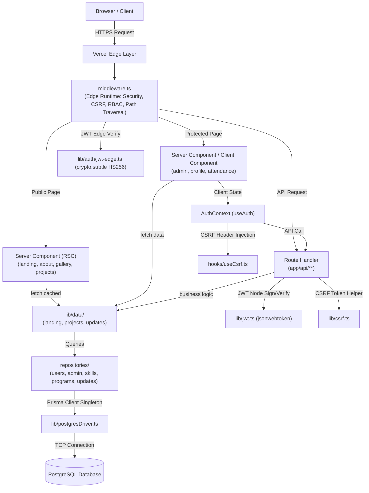
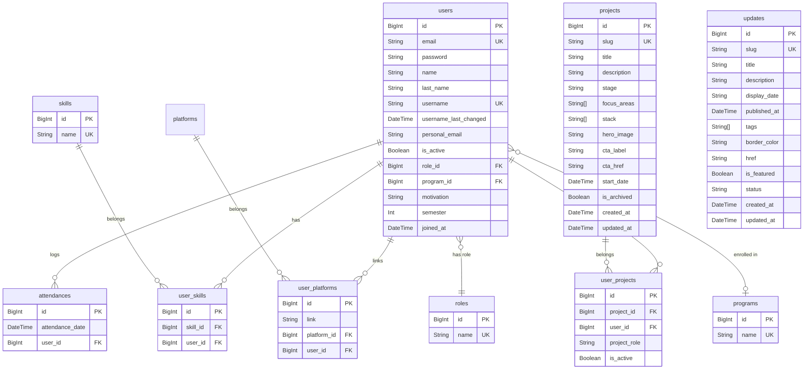

# Architecture

## Status

Active. This document reflects the actual architecture implemented in DevurityWeb, as deployed in production (in `main` branch).

## Institutional Context & Purpose

**DevurityWeb** is the official web platform for the **Semillero de Investigación Devurity** (Cybersecurity & Software Engineering Research Seedbed) at **Universidad Surcolombiana** (Neiva, Colombia).

It fulfills two core operational needs:
1. **Public Information**: Institutional presentation, project portfolio catalog, news/events feed, gallery, and public member profiles.
2. **Internal Management**: Institutional member onboarding, dynamic QR-based attendance tracking, project traceability, profile editing, and role-based administration.

DevurityWeb also serves as the formal graduation thesis (*modalidad de grado*) for the core engineering team. The development scope is structured across two active workstreams:
- **Plataforma Web del Semillero**
- **Módulo de Trazabilidad de Proyectos**

## Tech Stack Overview

| Layer | Technology | Version | Purpose / Notes |
|---|---|---|---|
| Framework | Next.js (App Router) | 15.5.19 | RSC, Server Actions, Route Handlers |
| UI Library | React | 19.1.2 | Server & Client components |
| Language | TypeScript | 5.9.3 | Strict mode |
| Styling | Tailwind CSS | 4.2.4 | Configured via `@tailwindcss/postcss` |
| ORM | Prisma | 6.19.3 | Custom output path `lib/generated/prisma` |
| Database | PostgreSQL | 16+ | Relational datastore |
| Password Hashing | `bcryptjs` | 3.0.3 | Pure JavaScript wrapper (`lib/bcrypt.ts`) |
| Auth JWT (Node.js) | `jsonwebtoken` | 9.0.3 | Node.js route handlers (`lib/jwt.ts`) |
| Auth JWT (Edge) | Web Crypto API | Native | Edge Middleware (`lib/auth/jwt-edge.ts`) |
| Animations | Framer Motion | 12.38.0 | UI transitions (`LazyMotion` domAnimation) |
| Icons | Heroicons | 2.2.0 | Micro-icons via `components/icons/` |
| Attendance QR | `html5-qrcode` & `qrcode` | 2.3.8 / 1.5.4 | Camera scanning and QR rendering |
| Email Service | Nodemailer | 9.0.1 | Verification and password reset emails |
| Testing | node:test | Built-in | Node.js native test runner (`tests/*.node-test.ts`) |

## High-Level Architecture

## Layer Details

### 1. Middleware (`middleware.ts`)

Executes on every request before reaching page components or API handlers (excluding static assets, `_next`, images, and metadata files). Workflow:

1. **Active Session Check**: If `auth_token` cookie is present and user accesses `/auth/login`, decode token via Edge JWT and redirect to `/profile/[id]`.
2. **Path Normalization & Redirect Map**: Normalize trailing slashes; map `/auth`, `/login`, and `/register` to standard auth paths.
3. **Path Traversal & Fragment Hardening**: Block requests containing `..`, `%2e%2e`, `.env`, `.git`, `package.json`, `tsconfig`, `next.config`.
4. **Auth Guard**: Unauthenticated requests to protected paths (`/admin`, `/profile`, `/attendance`) redirect to `/auth/login` (pages) or return 401 JSON (APIs).
5. **RBAC Guard**: Enforces `role === "admin"` in JWT payload for all `/admin` and `/api/admin` routes via `checkUserRole()`.
6. **CSRF Validation**: State-changing requests (`POST`, `PUT`, `PATCH`, `DELETE`) verify matching `x-csrf-token` header and `csrf_token` cookie using constant-time comparison (`timingSafeEqual`). Exempt public routes bypass check.
7. **Auth Middleware Delegate**: Delegates fine-grained protected path verification to `lib/auth/middleware.ts`.

### 2. Route Handlers (`app/api/`)

Standard Next.js App Router REST route handlers:

- **Auth Endpoints** (`app/api/auth/`): `login`, `register`, `logout`, `refresh`, `me`, `csrf-token`, `forgot-password`, `reset-password`, `profile`, `skills`, `users`, `programs`, `verify-role`, `is-admin`.
- **Admin Endpoints** (`app/api/admin/`): `users` (paginated list, search, role/status update, delete), `attendances`, `dashboard`.
- **Domain Endpoints**: `/api/asistencia`, `/api/qr-dinamico`, `/api/contact`, `/api/skills`, `/api/team`.

**[DECISION]** Auth token set as `auth_token` in HttpOnly cookie with `SameSite=Strict` and `Secure` in production. Token subject (`sub`) contains BigInt user ID converted to string.

### 3. Business Logic & Caching Layer (`lib/data/`)

Server-side data fetchers wrapping repository calls with Next.js caching strategies:

| Module | Scope / Functionality | Caching Strategy |
|---|---|---|
| `landing.ts` | Quick nav, featured projects, gallery preview, latest news | `unstable_cache` on `getLandingNews` (21,600s / 6h) |
| `projects.ts` | Project catalog and category filters | `unstable_cache` on `getProjectsCatalog` (21,600s / 6h) |
| `updates.ts` | News & announcements feed | `unstable_cache` on `getUpdatesFeed` and `getLatestNewsForLanding` (60s) |
| `admin.ts` | Admin dashboard statistics | Dynamic / No cache (real-time query) |

*Note*: `app/page.tsx` explicitly sets `export const dynamic = "force-dynamic"` to guarantee fresh server rendering and avoid build-time database connection locks during production deployment.

### 4. Data Access Layer (`repositories/`)

Isolated database access layer using the Prisma Client.

| Repository | Scope / Methods |
|---|---|
| `users/users.repositories.ts` | `findByEmailWithRole`, `findByUsername`, `findByIdWithFullProfile`, `createUser` (transactional), `updateUserProfile` (transactional profile/skills/links update), `existUserByEmail`, `activateUser`, `deleteInactiveUser` |
| `admin/users.repositories.ts` | `getAdminUsersPaginated` (search, role, status filters), `updateUserRole`, `updateUserStatus`, `deleteUserCompletely` |
| `skills/skills.repositories.ts` | Skill querying and creation |
| `programs/programs.repositories.ts` | Academic programs listing |
| `updates/updates.repositories.ts` | `getPublishedUpdates`, `getLatestUpdates` |

**BigInt Serialization Rule**: Prisma uses native `BigInt` for primary and foreign keys. JavaScript `JSON.stringify` cannot serialize BigInt. All repository and route handler functions **must** convert BigInt values using `.toString()` before returning response payloads. Never use `toBigInt()` for serialization — it converts toward BigInt, not away from it.

### 5. Database Layer (Prisma + PostgreSQL)

Prisma ORM mapping to 11 models with `@default(autoincrement())` BigInt primary keys:

- **Cascade Deletes**: `attendances` -> `users` and `user_skills` -> `users` use `onDelete: Cascade`.
- **Manual Deletes**: `user_platforms` and `user_projects` use `onDelete: NoAction` and require explicit transaction cleanup inside `deleteUserCompletely` and `updateUserProfile`.
- **Custom Output Path**: Prisma client generated at `lib/generated/prisma/` via `prisma/schema.prisma`.

### 6. Client Layer & Hooks

- **AuthContext** (`contexts/AuthContext.tsx`): React Context providing `user`, `isAuthenticated`, `isLoading`, `login`, `logout`, `hasRole`, and `isAdmin` to all client components.
- **Custom Hooks**:
  - `useCsrf`: Fetches CSRF token from `/api/auth/csrf-token` and provides mutation helper `fetchWithCsrf`.
  - `useAuth`: Direct authentication actions.
  - `useProfileData`: Profile fetching and updating.
  - Data hooks: `usePrograms`, `useProjects`, `useUpdates`, `useAvailableSkills`, `useSkillObjects`, `useTokenValidation`.

## Security Architecture

### Dual JWT Verification Strategy

Edge Middleware cannot execute Node.js native modules (`jsonwebtoken`). The project uses two complementary implementations sharing `JWT_SECRET`:

| Context | Implementation | Target Module |
|---|---|---|
| Route Handlers (Node.js) | `jsonwebtoken` library | `lib/jwt.ts` |
| Edge Middleware (V8 Isolates) | Web Crypto API (`crypto.subtle` HS256) | `lib/auth/jwt-edge.ts` |

### Double-Submit Cookie CSRF Protection

1. Client fetches CSRF token from `GET /api/auth/csrf-token`.
2. Token stored in `csrf_token` cookie and returned in body.
3. Client includes token in `x-csrf-token` header on state-changing requests (`POST`, `PUT`, `PATCH`, `DELETE`).
4. Middleware validates token header against cookie using `timingSafeEqual` (`lib/csrf.ts`).

Exempt endpoints bypass CSRF checks: `/api/auth/login`, `/api/auth/register`, `/api/auth/logout`, `/api/auth/refresh`, `/api/auth/is-admin`, `/api/auth/forgot-password`, `/api/auth/reset-password`, `/api/qr-dinamico`, `/api/admin/attendances`. Note: `/api/asistencia` is exempt in middleware but validates CSRF internally in its route handler (`app/api/asistencia/route.ts`), so it is not listed as a public exception.

## Deployment & CI/CD Pipeline

- **Target Platform**: Vercel Serverless (Region `gru1` Sao Paulo).
- **Vercel Build Command**: `prisma migrate deploy && next build`
- **CI Workflow** (`.github/workflows/ci.yml`):
  1. Setup Node.js 24 + pnpm.
  2. Install dependencies with `pnpm install --frozen-lockfile`.
  3. `npx prisma generate`.
  4. Typecheck: `npx tsc --noEmit`.
  5. Lint: `pnpm run lint`.
  6. Build: `pnpm run build`.

### Supply Chain Security

`pnpm-workspace.yaml` enforces supply chain hardening:

- **`allowBuilds`**: only whitelisted packages run install scripts (`@prisma/client`, `@prisma/engines`, `esbuild`, `prisma`, `sharp`, `unrs-resolver`).
- **`minimumReleaseAge: 1440`**: blocks packages published less than 24 hours ago.
- **`minimumReleaseAgeIgnoreMissingTime: true`**: skips the check gracefully when npm registry metadata lacks a `time` field.

Dependencies are pinned with exact versions (no `^` or `~`). The lockfile (`pnpm-lock.yaml`) is committed and used with `--frozen-lockfile` in CI.

## Known Limitations & Technical Debt

| Area | Issue | Impact | Mitigation / Status |
|---|---|---|---|
| Rate Limiting | In-memory `Map` limiter | Resets on Vercel cold starts; stateless across serverless instances | Planned Redis/Upstash migration |
| Automated Testing | Suite operational with node:test | Four test files exist (`jwt`, `csrf`, `qr-attendance`, `regex`); `tests/unit/` and `tests/integration/` remain empty | Extend coverage to `lib/` and `repositories/` |
| Schema Roles | Admin UI role options vs DB seeds | UI shows `content_manager`/`lead_project` options, but DB only seeds `admin`/`user` | Ensure DB roles match UI selection list |
| BigInt Serialization | Manual `.toString()` requirement | Unhandled BigInts cause runtime `JSON.stringify` failure | Strict repository conversion convention |

## Verification Command Checklist

Before committing architectural or code changes:

1. `pnpm lint` — ESLint validation
2. `npx tsc --noEmit` — TypeScript strict typecheck
3. `pnpm test` — node:test runner execution
4. `pnpm build` — Production build compilation
